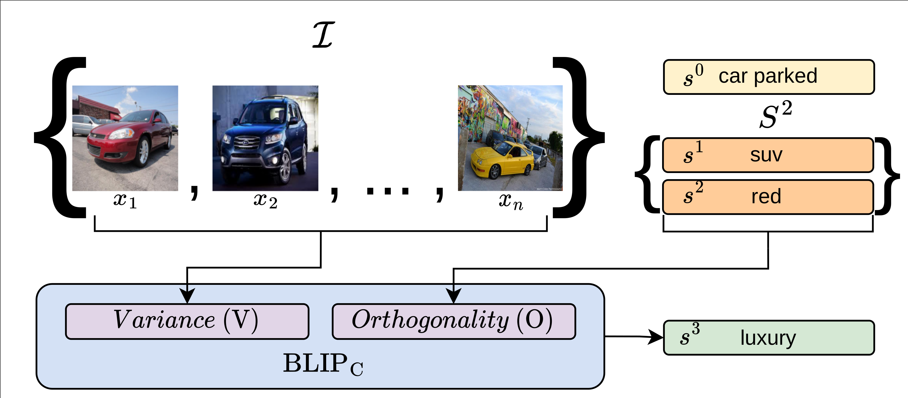
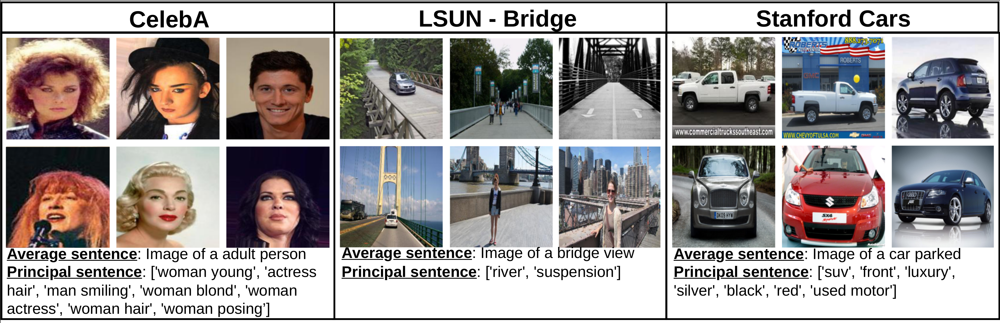
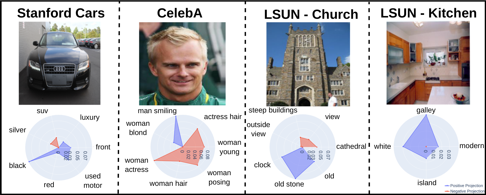

# Describing Sets of Images with Textual-PCA [Findings of EMNLP 2022]

[//]: # ([[Paper]]&#40;https://arxiv.org/abs/2210.12112&#41; [[Notebook]]&#40;https://www.kaggle.com/notebook&#41;)

Official implementation of ["Describing Sets of Images with Textual-PCA"](https://arxiv.org/abs/2210.12112).

## Approach



__Abstract__: We seek to semantically describe a set of images, capturing both the attributes of single images and the
variations within the set. Our procedure is analogous to Principle Component Analysis, in which the role of projection
vectors is replaced with generated phrases. First, a centroid phrase that has the largest average semantic similarity to
the images in the set is generated, where both the computation of the similarity and the generation are based on
pretrained vision-language models. Then, the phrase that generates the highest variation among the similarity scores is
generated, using the same models. The next phrase maximizes the variance subject to being orthogonal, in the latent
space, to the highest-variance phrase, and the process continues. Our experiments show that our method is able to
convincingly capture the essence of image sets and describe the individual elements in a semantically meaningful way
within the context of the entire set.

## Examples of Textual PCA



## Example of radar plots



## Usage

```bash
$ python run_textual_pca.py
--number_principal_phrases 7
--variance_coeff 10.0
--logit_coeff 8.0
--prev_phrases_dist_coeff -80.0
--dataset_path "./datasets/custom_dataset" 
```

## Reference

If you found this code useful, we would appreciate you citing the related paper

```bib
@article{hupert2022describing,
  title={Describing Sets of Images with Textual-PCA},
  author={Hupert, Oded and Schwartz, Idan and Wolf, Lior},
  journal={arXiv preprint arXiv:2210.12112},
  year={2022}
}
```